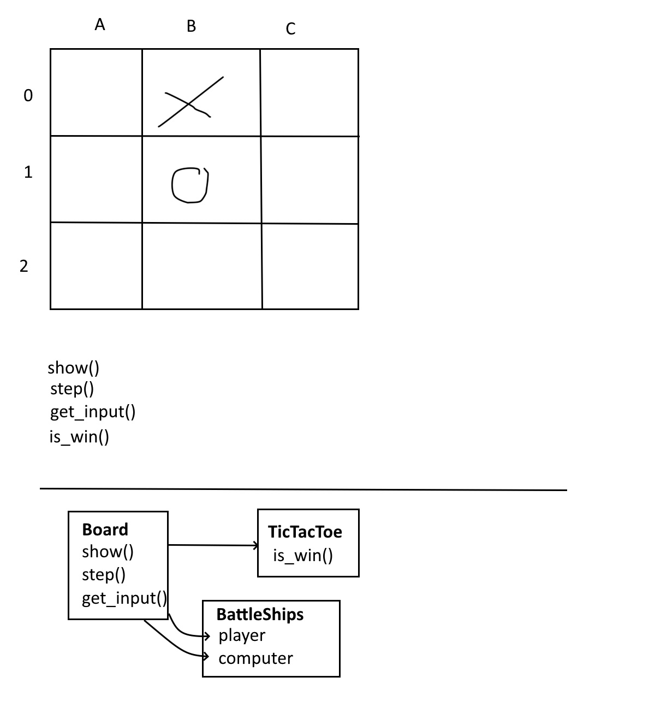

Recording: https://panopto.dtu.dk/Panopto/Pages/Sessions/List.aspx#folderID=%220acbc7a6-af50-424e-b5fb-afc500bd4fdd%22

# OOP-For-Dummies
Simple project for illustrating OOP

**Date**: Tuesday 14/3
**Time**: 09:00
**Place**: build. 341 / aud. 23 

Description:
Join me for an exciting live coding event where I’ll be implementing two classic games - Tic Tac Toe and Battleships!
I’ll guide you through the process of building these games from scratch (no libraries), explaining each step along the way. 
No laptops required, as I will be the one coding. I expect there to be a little participation through discussion and questions. 
You'll get a chance to see how a real-world software project comes to life as I write code, debug, and test the implementations.

This live coding event is perfect for anyone who wants to learn more about programming or improve their coding skills. Join me for an unforgettable experience and take your coding skills to the next level!

## GitHub copilot
- Add student mail: https://github.com/settings/emails
- Submit application and verify with picture of student card: https://education.github.com/pack

## Future inspirations
- Explanation of algorithms that your can code yourself https://www.youtube.com/@Reducible
- Expert level code practices https://www.youtube.com/@CodeAesthetic
